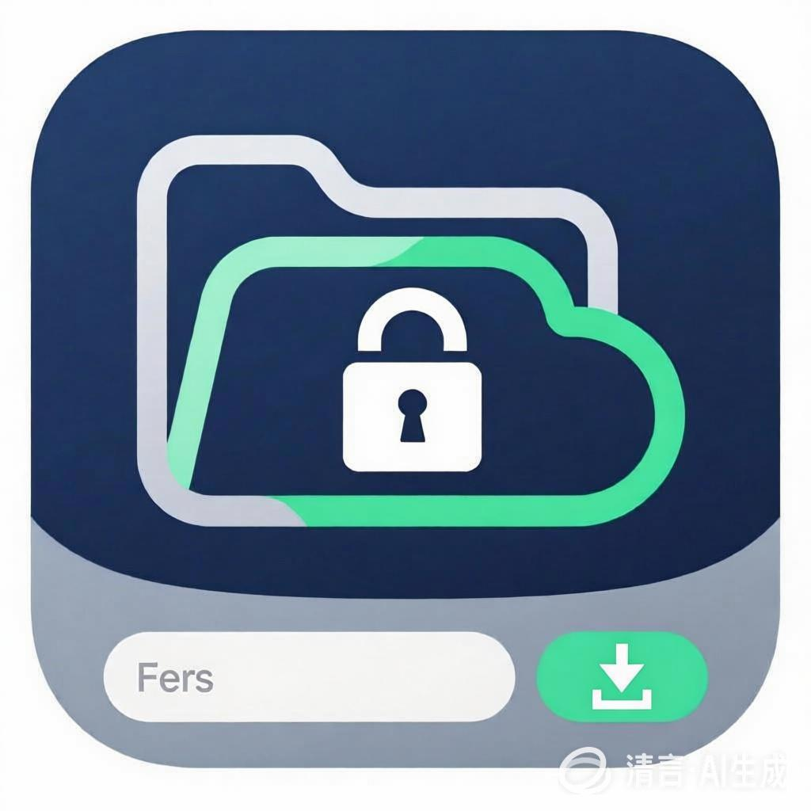

# FERS - File Encrypt & Remote Storage

<div align="center">



**一个安全、易用的文件加密与云存储管理工具**

[](https://golang.org/)
[](https://fyne.io/)
[](LICENSE)

</div>

## ✨ 项目特色

FERS (File Encrypt & Remote Storage) 是一个专为隐私保护而设计的文件管理工具，具有以下独特优势：

### 🔐 **端到端加密**

- 采用 **AES-256-GCM** 军用级加密算法
- 文件在本地加密后上传，密钥永不离开本地
- 提供数据完整性验证，防止文件被篡改

### 🌐 **多存储后端支持**

- **阿里云 OSS** - 生产环境云存储
- **本地模拟** - 开发测试环境
- 模块化设计，易于扩展其他云服务商

### 🖥️ **直观的图形界面**

- 基于 Fyne 框架的跨平台 GUI
- 文件浏览器式操作体验
- 实时日志显示，操作状态一目了然
- 支持批量文件选择和下载

### ⚡ **智能同步功能**

- **双向同步** - 自动识别本地和远程的文件差异
- **增量上传** - 只上传本地新增的文件
- **选择性下载** - 可选择特定远程文件下载
- **操作取消** - 长时间操作可随时中断

### 🛡️ **安全设计**

- 工作目录限制，防止意外访问系统文件
- 路径验证，防止目录遍历攻击
- 结构化日志记录，便于审计和故障排除

## 🚀 快速开始

### 系统要求

- **操作系统**: Windows 10/11, macOS 10.14+, Linux
- **Go 版本**: 1.24.6 或更高版本
- **网络**: 稳定的互联网连接（使用云存储时）

### 安装方式

#### 方式一：下载预编译版本

从 [Releases](https://github.com/mingregister/fers/releases) 页面下载适合您系统的可执行文件。

#### 方式二：从源码构建

```bash
# 克隆项目
git clone https://github.com/mingregister/fers.git
cd fers

# 构建可执行文件
go build -o fers main.go

# Windows 用户可使用构建脚本
build.bat
```

### 配置设置

在用户Home目录下创建 `.fers/config.yaml` 文件：

```yaml
# 加密密钥（请使用强密码）
crypto_key: "your-strong-encryption-password"

# 日志文件路径
log: "app.log"

# 工作目录（所有操作限制在此目录内）
target_dir: "/path/to/your/working/directory"

# 存储配置
storage:
  # 存储类型：oss（阿里云）或 localhost（本地测试）
  remote_type: "oss"
  
  # 阿里云 OSS 配置
  oss:
    endpoint: "oss-cn-hangzhou.aliyuncs.com"
    region: "cn-hangzhou"
    access_key_id: "your-access-key-id"
    access_key_secret: "your-access-key-secret"
    bucket_name: "your-bucket-name"
    workDir: "your-remote-folder"
  
  # 本地测试配置
  localhost:
    workdir: "/path/to/local/storage"
```

## 📖 使用指南

### 启动应用

双击可执行文件或在终端中运行：

```bash
./fers
```

### 主要功能

#### 🔒 **加密上传**

1. 在文件列表中选择要上传的文件或文件夹
2. 点击 **"Encrypt & Upload"** 按钮
3. 文件将被加密并上传到远程存储

#### 📥 **同步下载**

- 点击 **"Sync Download"** - 下载远程存在但本地缺失的文件
- 点击 **"Download Specific"** - 选择特定的远程文件进行下载

#### 📤 **同步上传**

- 点击 **"Sync Upload"** - 上传本地存在但远程缺失的文件

#### 🗂️ **目录导航**

- 点击 **"Up"** - 返回上级目录
- 选择文件夹后点击 **"Enter"** - 进入子目录
- 所有操作限制在配置的工作目录内

#### 🗑️ **文件管理**

- 选择文件后点击 **"Delete Local File"** - 删除本地文件
- 点击 **"Refresh"** - 刷新文件列表

#### ⏹️ **操作控制**

- 点击 **"Cancel Operation"** - 取消正在进行的长时间操作

### 界面说明

```
┌─────────────────────────────────────────────────────────────┐
│ Working dir: /your/working/directory                        │
│ Current dir: /your/working/directory/subfolder             │
├─────────────────────────────────────────────────────────────┤
│ [Up] [Enter]                                                │
│ ├─ 📁 Documents/                                           │
│ ├─ 📁 Photos/                                              │
│ ├─ 📄 important.txt                                        │
│ └─ 📄 secret.pdf                                           │
├─────────────────────────────────────────────────────────────┤
│ Application Logs                                            │
│ 2024-01-01 10:00:00 INFO Application started successfully  │
│ 2024-01-01 10:01:00 INFO File encrypted and uploaded       │
└─────────────────────────────────────────────────────────────┘
```

## 🔧 高级配置

### 存储后端切换

#### 使用阿里云 OSS

```yaml
storage:
  remote_type: "oss"
  oss:
    endpoint: "oss-cn-hangzhou.aliyuncs.com"
    # ... 其他 OSS 配置
```

#### 使用本地存储（测试）

```yaml
storage:
  remote_type: "localhost"
  localhost:
    workdir: "/path/to/local/storage"
```

### 安全建议

1. **密钥管理**
   - 使用包含大小写字母、数字和特殊字符的强密码
   - 定期更换加密密钥
   - 妥善备份密钥，丢失后无法恢复文件

2. **访问控制**
   - 定期轮换云存储访问密钥
   - 使用最小权限原则配置 OSS 权限
   - 监控云存储访问日志

3. **数据备份**
   - 定期备份重要的加密文件
   - 在多个位置存储密钥备份
   - 测试恢复流程的有效性

## 🛠️ 开发者信息

### 技术架构

- **编程语言**: Go 1.24.6
- **GUI 框架**: Fyne v2.6.3
- **加密算法**: AES-256-GCM
- **云存储**: 阿里云 OSS SDK v2
- **配置管理**: Viper
- **日志系统**: slog

### 项目结构

```
fers/
├── main.go                 # 应用程序入口
├── pkg/
│   ├── config/            # 配置管理
│   ├── crypto/            # 加密解密
│   ├── storage/           # 存储抽象层
│   ├── dir/               # 文件管理
│   └── appui/             # 用户界面
├── config.yaml            # 配置文件
└── README.md              # 项目文档
```

### 扩展开发

项目采用模块化设计，支持以下扩展：

- **新的存储后端**: 实现 `storage.Client` 接口
- **新的加密算法**: 实现 `crypto.Cipher` 接口
- **新的 UI 框架**: 重新实现 UI 层

## 🐛 故障排除

### 常见问题

**Q: 应用启动失败，提示配置文件未找到**
A: 确保 `.fers/config.yaml` 文件位于用户home目录下，或者在当前工作目录中。

**Q: 连接 OSS 失败**
A: 检查网络连接、OSS 配置信息是否正确，以及访问密钥是否有效。

**Q: 文件加密失败**
A: 检查文件权限、磁盘空间，以及加密密钥配置是否正确。

**Q: 无法进入某个目录**
A: 确保目录在配置的工作目录范围内，应用不允许访问工作目录外的文件。

### 日志分析

应用会在配置的日志文件中记录详细信息：

- **INFO** 级别：正常操作记录
- **ERROR** 级别：错误信息和堆栈跟踪
- **DEBUG** 级别：详细的调试信息

## 📄 许可证

本项目采用 MIT 许可证 - 查看 [LICENSE](LICENSE) 文件了解详情。

## 🤝 贡献

欢迎提交 Issue 和 Pull Request！

1. Fork 本项目
2. 创建特性分支 (`git checkout -b feature/AmazingFeature`)
3. 提交更改 (`git commit -m 'Add some AmazingFeature'`)
4. 推送到分支 (`git push origin feature/AmazingFeature`)
5. 开启 Pull Request

## 📞 支持

如果您在使用过程中遇到问题，可以通过以下方式获取帮助：

- 📧 提交 [Issue](https://github.com/mingregister/fers/issues)
- 📖 查看 [项目文档](PROJECT_OVERVIEW.md)
- 💬 参与 [讨论](https://github.com/mingregister/fers/discussions)

---

<div align="center">

**⭐ 如果这个项目对您有帮助，请给我们一个 Star！**

Made with ❤️ by [mingregister](https://github.com/mingregister)

</div>
